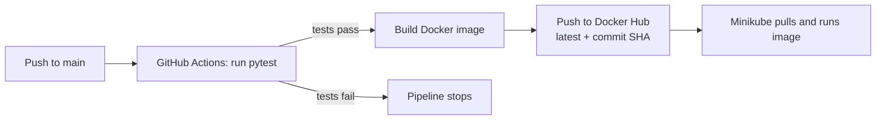

# CI/CD Pipeline with GitHub Actions & Docker


An end-to-end CI/CD pipeline that tests a Flask app, builds a Docker image, pushes it to Docker Hub, and deploys it on a local Kubernetes cluster (Minikube). No paid cloud services are needed.

**Docker image:** [`swarooparepalli/devops-app`](https://hub.docker.com/r/swarooparepalli/devops-app)

## Pipeline Overview



1. A push to `main` triggers the workflow (pull requests run the tests only).
2. The **test** job installs dependencies and runs `pytest`.
3. If the tests pass, the **build-and-push** job builds the image and pushes it to Docker Hub with two tags: `latest` and the commit SHA.
4. Minikube pulls the image and runs it as a 2-replica Deployment.

## Tech Stack

| Tool | Purpose |
|---|---|
| Python, Flask, Gunicorn | Sample web app and WSGI server |
| Pytest | Automated tests |
| GitHub Actions | CI/CD automation |
| Docker, Docker Compose | Containerisation and local run |
| Docker Hub | Image registry |
| Minikube, kubectl | Local Kubernetes deployment |

## Project Structure

```
.
├── .github/workflows/ci-cd.yml   # CI/CD pipeline
├── app/
│   ├── main.py                   # Flask app (/ and /health)
│   └── requirements.txt
├── tests/
│   └── test_app.py               # pytest tests
├── k8s/
│   ├── deployment.yaml           # 2 replicas, readiness probe
│   └── service.yaml              # NodePort service
├── Dockerfile
├── docker-compose.yml
├── pytest.ini
└── README.md
```

## Endpoints

| Route | Response |
|---|---|
| `/` | `{"message": "Hello from my CI/CD pipeline!", "version": "1.0"}` |
| `/health` | `{"status": "ok"}` |

## Run It Yourself

### 1. Run the tests

```bash
python -m venv venv
source venv/bin/activate        # Windows: venv\Scripts\activate
pip install -r app/requirements.txt pytest
pytest
```

### 2. Run with Docker Compose

```bash
docker compose up --build
```

Open http://localhost:5000 and http://localhost:5000/health.

### 3. Run the published image

```bash
docker run -p 5000:5000 swarooparepalli/devops-app:latest
```

### 4. Deploy on Minikube

```bash
minikube start --driver=docker
kubectl apply -f k8s/
kubectl get pods
minikube service devops-app --url
```

Open the printed URL in your browser and keep the terminal open.

## Setting Up the Pipeline in Your Own Fork

Add these repository secrets under **Settings → Secrets and variables → Actions**:

| Name | Value |
|---|---|
| `DOCKERHUB_USERNAME` | Your Docker Hub username |
| `DOCKERHUB_TOKEN` | A Docker Hub access token with Read & Write permission |

Then update the image name in `.github/workflows/ci-cd.yml` and `k8s/deployment.yaml` if you use a different repository name.

## Screenshots

| Green pipeline run | Docker Hub tags |
|---|---|
|  |  |

| Pods running in Minikube | App in browser |
|---|---|
|  |  |

| Failing test stops the pipeline |
|---|
|  |

## Key Features

- Automated tests act as a quality gate before any image is built
- Images are tagged with the commit SHA for traceability and easy rollback
- Docker Hub credentials are stored as GitHub Secrets, never in code
- The container runs as a non-root user
- Kubernetes readiness probe checks `/health` before sending traffic

## Possible Improvements

- Add a Trivy vulnerability scan to the pipeline
- Add Docker layer caching to speed up builds
- Use ArgoCD for GitOps-style deployment

## Author

**Swaroop Arepalli**
GitHub: [@arepallinagaswaroop](https://github.com/arepallinagaswaroop)
